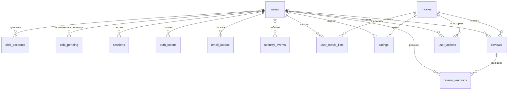

# Схема основной БД

PostgreSQL 16 (wiki `Стек_технологий`, разд. 3). DDL: [db-schema.sql](db-schema.sql), он же
первая миграция. Задача #17627.

## Состав

| Сущность из #17393 п. 2 | Таблица | Требования |
|---|---|---|
| Метаданные фильмов | `movies` | #17241, #17640, #17193 |
| Профили | `users` | #17030, #17148 |
| Пользовательские данные: списки | `user_movie_lists` | #17026, #17027 |
| Оценки | `ratings` | #17028 |
| Отзывы | `reviews`, `review_reactions` | #17029, #17239 |
| Вердикты | `reviews.verdict` | #17029 п. 1.1 |
| История действий | `user_actions` | #17093 п. 2.9 |

Служебные таблицы backend (решения 27.09, wiki `PostgreSQL`):

| Назначение | Таблица | Требования |
|---|---|---|
| Привязка OIDC-аккаунтов | `oidc_accounts` | #17148 п. 3, #17149 п. 3 |
| Незавершенный вход через OIDC | `oidc_pending` | #17148 п. 3.2, #17149 п. 3 |
| Серверные сессии | `sessions` | #17094 п. 1.3, #17151, #17150 п. 2.5 |
| Ссылки подтверждения email и сброса пароля | `auth_tokens` | #17148 п. 2.5, #17150 п. 1.2 |
| Очередь исходящих писем | `email_outbox` | #17148 п. 2.5, #17150 п. 2.5, 3.3 |
| Журнал событий безопасности | `security_events` | #17094 п. 5.1, 5.2 |
| Счетчик неудачных входов и блокировка | `users.failed_login_count`, `users.locked_until` | #17094 п. 3.3, #17149 п. 2.5 |

## Связи



`|o` - при удалении профиля строка остается, `user_id` становится NULL (раздел «Удаление»).
Колонки, типы и ограничения - в [db-schema.sql](db-schema.sql), здесь только решения.

## Общие правила

- `movie_id` - id фильма в TMDB и первичный ключ `movies`, без суррогатного ключа (#17241,
  #17640). Тот же `movie_id` лежит в payload векторов Qdrant (#17392 п. 4) и возвращается
  ML-сервисом (#17241), поэтому второе отображение ключей не нужно.
- Перечисления - `text` + `CHECK`, а не `CREATE TYPE ... AS ENUM`: у `ALTER TYPE ... ADD VALUE`
  нет обратной операции, а обратная миграция нужна у каждой (#17098 п. 2.3).
- Остальные ключи - `bigint GENERATED ALWAYS AS IDENTITY`. Время - `timestamptz`.
- Пустое значение - NULL у скалярных полей и `[]` у списков, пустые строки запрещены `CHECK`.
  Так скрипт каталога считает долю неполных метаданных одним запросом (#17640, риск #17300).
- Индексы только под запросы из требований. У `movie_id` в `user_movie_lists` и `user_actions`
  индекса нет: удаление фильма - редкая операция оператора, остальные запросы идут от `user_id`.

## Каталог фильмов

Одна строка на фильм, состав полей - таблица из #17640:

| Поле #17640 | Колонка | Тип | Блок #17193 | Нет данных |
|---|---|---|---|---|
| movie_id | `movie_id` | bigint, PK | везде | - |
| Название на русском | `title` | text, ICU `ru-RU` | 3 | не бывает: без ru-названия фильм не берется (#17640) |
| Оригинальное название | `original_title` | text | 3 | - |
| Год выпуска | `release_date` | date, год берется из даты | 3 | NULL |
| Возрастное ограничение | `age_rating` | text: `0+`, `6+`, `12+`, `16+`, `18+` | 3 | NULL |
| Ссылка на постер | `poster_path` | text, путь на CDN TMDB | 1 | NULL |
| Страны производства | `countries` | jsonb | 8 | `[]` |
| Жанры | `genres` | jsonb | 8 | `[]` |
| Длительность | `runtime_min` | smallint, минуты | 8 | NULL |
| Режиссеры, сценаристы, композиторы, продюсеры | `crew` | jsonb | 8 | `[]` |
| Описание сюжета | `overview` | text | 9 | NULL |
| Актеры | `actors` | jsonb | 10 | `[]` |

Служебные колонки: `cached_at` - когда метаданные получены из TMDB; `indexed_at` - когда
векторы фильма записаны в Qdrant (#17650). Каталог #17640 собирается раньше индексации,
поэтому фильм с `indexed_at IS NULL` есть в карточках, но не находится поиском.

Элементы JSONB-списков, порядок в массиве - порядок показа:

| Колонка | Элемент |
|---|---|
| `genres` | `{"id": 18, "name": "драма"}` - id жанра TMDB, название на ru-RU |
| `countries` | `{"code": "US", "name": "США"}` - код ISO 3166-1 |
| `crew` | `{"person_id": 525, "name": "Кристофер Нолан", "role": "director"}`, `role`: `director`, `writer`, `composer`, `producer` |
| `actors` | `{"person_id": 3895, "name": "Майкл Кейн", "character": "профессор Брэнд", "profile_path": "/x.jpg"}` в порядке `order` из TMDB |

Постер: в БД путь TMDB (`/abc.jpg`), URL `https://image.tmdb.org/t/p/<размер><poster_path>`
собирает backend, размер - его настройка. Файл тянет браузер с CDN (#17393 п. 2).

**Скалярные поля карточки - колонками, списки - JSONB.**

Альтернативы: нормализация (`genres`, `countries`, `people`, `movie_credits`); весь ответ TMDB
одним JSONB.

Почему:
- Списки читаются только целиком для карточки. Фильтров по жанру или персоне в требованиях нет,
  поиск целиком в ML-сервисе (#17241). Одна строка - одна выборка на карточку и один upsert в
  скрипте каталога.
- JSONB для кеша TMDB предусмотрен wiki `Стек_технологий`, разд. 3.
- Поля блоков 1, 3, 8, 9 - явные колонки с типами: по ним сверяется OpenAPI карточки (#17630).
- Сырой ответ TMDB не храним: в нем десятки полей, которых нет в #17640, а `crew` целиком -
  сотни записей.

Закрывает: #17393 п. 2, #17241, #17640.

Название фильма хранится с ICU-сортировкой `ru-RU`: сортировка «А-Я» в списках профиля
(#17030 п. 2.4.6.3) с `C` ставит латиницу раньше кириллицы и «ё» в конец. Проверено на
PostgreSQL 16: `Амели | ёжик в тумане | Ешь, молись, люби | жизнь | Яблоко | Matrix`.
PostgreSQL 16 по умолчанию собирается с ICU.

Кто пишет:
- скрипты каталога и индексации (#17640, #17650) и backend при lookup в TMDB (#17241) - одним
  `INSERT ... ON CONFLICT (movie_id) DO UPDATE`. Повторный запуск не создает дублей (#17640);
- `indexed_at` ставит утилита индексации после записи векторов (#17393 п. 4, шаг 5);
- удаление фильма (#17393 п. 6) - `DELETE FROM movies` и удаление векторов из четырех коллекций.

## Учетные записи и доступ

**Пароль - только хеш Argon2id** (#17094 п. 2.2, wiki `Стек_технологий`, разд. 10).
`users.password_hash` хранит PHC-строку, `CHECK` требует префикс `$argon2id$`: открытый текст
или другой алгоритм БД не примет. NULL - аккаунт создан через OIDC и пароль не задан
(#17150 п. 3.1).

Состояния пользователя:
- `status`: `unconfirmed` до подтверждения email, затем `active` (#17148 п. 2.2, 2.5);
  `blocked` - «Учетная запись заблокирована» (#17149 п. 2.4). OIDC-аккаунт создается
  `active` на шаге «Завершение регистрации» (#17148 п. 3.2, шаг 10).
- Защита от подбора - отдельно от статуса: `failed_login_count` и `locked_until` (#17094 п. 3.3,
  #17149 п. 2.5). Пороги из #17149 п. 2.5: после 3 неудач подряд - CAPTCHA, после 5 -
  `locked_until = now() + 15 мин`. Успешный вход или конец блокировки обнуляют счетчик.
- Имя и email уникальны без учета регистра: уникальные индексы по `lower()`, без расширения
  `citext`. Формат имени - `CHECK` по #17148 п. 2.1, формат email (RFC 5322) проверяет backend.
- `birth_year` обязателен (`NOT NULL`). Учетная запись через OIDC создается только на шаге
  «Завершение регистрации», когда год рождения уже введен; до этого данные провайдера лежат в
  `oidc_pending`. Решение архитектора 27.09: в базе нет недосозданных записей, которые занимали
  бы имя и email после брошенной регистрации. В #17148 п. 3.2 шаг 7 запись создается сразу,
  для пользователя разницы нет.

`oidc_accounts`: ключ - пара (`provider`, `subject`), у пользователя не больше одной привязки к
провайдеру (#17148 п. 3.2, шаг 7). Привязка к существующему аккаунту после входа с паролем -
новая строка в этой таблице.

`oidc_pending`: незавершенный вход через OIDC (#17629, тег OIDC). В cookie `dv_oidc` -
случайный токен, в БД - его SHA-256, срок 30 минут. Строка создается перед уходом к провайдеру
(`state`, `code_verifier` для PKCE), после callback дополняется профилем провайдера. Исход
`link_required` хранит `link_user_id` - чью запись привязать после входа с паролем. После
входа или завершения регистрации строка удаляется, просроченные удаляет таймер backend.

`sessions`: в cookie `dv_session` - случайный токен 256 бит, в БД - его SHA-256, так что
копия таблицы не дает войти. `CHECK` не пускает срок больше 24 ч (#17094 п. 1.3). Выход удаляет
строку (#17151), сброс пароля - все сессии пользователя, смена из профиля - все, кроме текущей
(#17150 п. 2.5, 3.3). Таймер backend удаляет просроченные по индексу `expires_at`.
`expires_at` здесь и в `auth_tokens` считается в SQL (`now() + interval '24 hours'`), а не часами
backend: `created_at` берется из часов БД, и расхождение часов на секунду нарушит `CHECK`.

`auth_tokens`: одна строка на пользователя и назначение. Новая ссылка заменяет старую через
`ON CONFLICT (user_id, purpose) DO UPDATE` - «активна только одна» (#17148 п. 2.5,
#17150 п. 1.2). Использованная ссылка удаляется, поэтому «истекла или использована» - один
ответ (#17150 п. 2.2). Сроки 24 ч и 1 ч закреплены `CHECK`. От `created_at` считаются 60 с до
кнопки «Отправить повторно» (#17148 п. 2.2, шаг 10). В ссылке токен, в БД его SHA-256.

`email_outbox`: обработчик запроса пишет письмо в той же транзакции, что и ссылку. Фоновый поток
каждого экземпляра backend (до 4, #17096 п. 1.3) забирает письма так:

```sql
SELECT email_id, user_id, kind, payload
FROM email_outbox
WHERE status = 'pending' AND next_attempt_at <= now()
ORDER BY next_attempt_at
LIMIT 10
FOR UPDATE SKIP LOCKED;
```

`SKIP LOCKED` не дает двум экземплярам отправить одно письмо дважды. Адрес берется из
`users.email` в момент отправки. Отправлено - строка удаляется: в `payload` ссылка с токеном в
открытом виде и держать ее дольше нужного незачем. Ошибка SMTP - `attempts + 1` и новый
`next_attempt_at`; лимит попыток исчерпан - `status = 'failed'`. Строки `failed` удаляет тот же
таймер через 24 ч: ссылки в них к этому времени истекли. Лимит попыток и паузы - настройки
backend.

`security_events`: типы событий ровно из #17094 п. 5.1 - `login_success`, `login_failure`,
`logout`, `password_change` (сброс и смена из профиля), `access_denied` (запрос к защищенному
ресурсу без сессии или прав). В `details` - способ входа и провайдер, причина отказа (неверные
данные, блокировка, email не подтвержден), метод и путь запроса. Таймер удаляет записи старше
30 дней по индексу `occurred_at` (п. 5.2). Выборки для мониторинга (п. 5.3) - по времени,
`ip` и `user_id`. Партиционирование по дням отложено: на десятках тысяч событий в месяц
`DELETE` по индексу справляется. Если `access_denied` даст миллионы строк (оценка в разделе
«Объемы»), журнал переводится на партиции по дням и чистится `DROP PARTITION`.

## Пользовательские данные

`user_movie_lists`: оба списка в одной таблице, `list_type` = `want_to_watch` или `watched`.
Фильм может быть в обоих списках - требования этого не запрещают (#17026, #17027). Порядок -
`added_at` (#17026 п. 1, #17030 п. 2.4.6.1). Оценка хранится отдельно, поэтому отметка
«Просмотрено» ее не меняет (#17027 п. 1).

`ratings`: 1-10, одна оценка пользователя на фильм (#17028). Изменение - `UPDATE score`,
`created_at` - дата добавления для сортировки «Мои оценки» (#17030 п. 2.4.6).

`reviews`: заголовок до 150 символов, NULL - без заголовка; текст 300-10000 символов
(#17029 п. 1.2, 1.3). Длины через `char_length`, то есть в символах, а не в байтах. Один отзыв на
фильм (#17029 п. 2). Дата редактирования не хранится, только `is_edited` для пометки
«Редактирован» (#17029 п. 3). Удаление отзыва уносит реакции (#17029 п. 4).

`review_reactions`: `1` - «палец вверх», `-1` - «палец вниз», одна реакция пользователя на отзыв
(#17029 п. 5). Другой тип - `UPDATE`, повторное нажатие - `DELETE`. `sum(reaction)` дает «+N» или
«-N» из #17239. Реакцию на свой отзыв запрещает backend: это правило между двумя таблицами,
`CHECK` его не выразит, а триггер разнес бы проверку прав между кодом и БД (#17094 п. 4.1).

`user_actions`: история, одна строка на действие, пишется в той же транзакции, что и действие.
Типы - действия из #17026-#17029: списки, оценка, отзыв, реакция. Поисковые запросы в историю не
пишутся. Чтение истории профиля - по индексу (`user_id`, `occurred_at`), #17093 п. 2.9.

**Вердикт - колонка отзыва, а не таблица.**

Альтернативы: таблица `verdicts (user_id, movie_id, verdict)`.

Почему: вердикт выбирается только в форме отзыва и без него отзыв не публикуется (#17029 п. 1.1,
1.4, глоссарий `Verdict`). Отдельная таблица допускала бы вердикт без отзыва, а такого состояния
в интерфейсе нет. В БД коды `positive`, `neutral`, `negative`, подписи - на frontend.

Закрывает: #17393 п. 2, #17029.

**Средняя оценка, счетчики и статистика считаются запросом, а не хранятся.**

Альтернативы: счетчики в `movies` и `reviews` (сумма и число оценок, число реакций);
материализованное представление.

Почему: средняя по фильму - index-only scan по `ratings (movie_id) INCLUDE (score)`, при десятках
оценок на фильм это миллисекунды. Счетчики - второй источник правды, его пришлось бы обновлять в
той же транзакции во всех местах записи. Вернуться к счетчикам, если сортировка «Сначала лучшие»
отзывов (#17239) или списков по средней оценке (#17030 п. 2.4.6.4) не уложится в 2 с
(#17093 п. 2.1).

Закрывает: #17028 п. 1, #17030 п. 2.3, #17239.

| Что | Запрос |
|---|---|
| Средняя и число оценок фильма (#17028 п. 1) | `round(avg(score), 1), count(*)` по `ratings` фильма |
| Статистика профиля (#17030 п. 2.3) | число `watched` в `user_movie_lists`; `count`, `avg` по `ratings` пользователя; число `reviews` пользователя |
| «+N» отзыва (#17239) | `sum(reaction)` по `review_reactions` отзыва |
| «Сначала лучшие» (#17239) | `count(*) FILTER (WHERE reaction = 1) DESC, created_at DESC` |

## Удаление

| Что | Что происходит | Требование |
|---|---|---|
| Профиль | `DELETE FROM users`. Оценки и отзывы остаются с `user_id = NULL`, в интерфейсе «Удаленный пользователь». Сессии, OIDC-привязки, ссылки, письма, списки, реакции, история удаляются каскадом. В журнале безопасности `user_id` обнуляется | #17030 п. 3 |
| Фильм | `DELETE FROM movies`. Каскадом уходят списки, оценки, отзывы с реакциями, история по фильму. Векторы удаляются из четырех коллекций Qdrant отдельно | #17393 п. 6 |
| Отзыв | Реакции удаляются каскадом | #17029 п. 4 |

**Профиль удаляется физически.**

Альтернативы: мягкое удаление - флаг и затирание полей.

Почему: профиль «удаляется навсегда», имя «не сохраняется» (#17030 п. 3), персональные данные не
должны оставаться (#17094 п. 2.3, замечание про 152-ФЗ в #17030). `ON DELETE SET NULL` сохраняет
оценки и отзывы без автора, средняя оценка фильма не меняется. `UNIQUE (user_id, movie_id)` не
мешает: в PostgreSQL NULL в уникальном ключе не совпадают друг с другом. Мягкое удаление оставило
бы в таблице строки, которые пришлось бы вычищать отдельно.

Закрывает: #17030 п. 3, #17094 п. 2.3.

## Персональные данные

Меры по #17094 п. 2.3:
- Состав: `users.email`, `users.username`, `users.birth_year`, `users.avatar_key`,
  `oidc_accounts.subject`, `security_events.ip`, а также `oidc_pending.email` и
  `oidc_pending.display_name` не дольше 30 минут до завершения входа. Других копий нет, адрес
  письма берется из `users`.
- Секреты только хешами: пароль - Argon2id, токены сессий и ссылок - SHA-256. Исключение -
  `payload` письма в очереди до отправки.
- Срок хранения: журнал безопасности 30 дней, сессии и ссылки удаляются после истечения,
  профиль удаляется физически.
- Порт PostgreSQL наружу не публикуется (wiki `PostgreSQL`). Backend, dbmate и скрипты
  оператора подключаются одним пользователем БД из `.env` (#17636 п. 3). Скрипты каталога и
  индексации пишут только в `movies` и схему не меняют (wiki `Стек_технологий`, разд. 11).

## Граница с векторным хранилищем

| Данные | Где |
|---|---|
| Эмбеддинги четырех модальностей, payload `movie_id`, `type`, `offset_sec` (#17392 п. 3, 4) | Qdrant |
| Метаданные фильмов, пользовательские данные, сессии, очередь писем, журналы | PostgreSQL |
| Исходные видеофайлы, кадры, видео-сегменты, аудио-чанки, аудиодорожки (#17393 п. 3) | нигде в production: временные артефакты индексации |
| Постеры и фото актеров | CDN TMDB, в БД путь (#17393 п. 2) |
| Фото профиля | MinIO, в БД ключ объекта (wiki `MinIO`) |
| Поисковые запросы: текст и файлы | в PostgreSQL не пишутся |

PostgreSQL и Qdrant связывает только `movie_id`, внешнего ключа между ними нет. Индексация пишет
метаданные в PostgreSQL раньше векторов (#17393 п. 4, шаги 4 и 5), поэтому у каждого вектора есть
строка в `movies`. Если ML-сервис все же вернет `movie_id` без строки, backend делает lookup в
TMDB (#17241).

## Объемы

Замерено на PostgreSQL 16 на синтетических данных: 1000 фильмов и 1000 пользователей, размер с
индексами и TOAST, затем умножено на 10.

| Данные | Допущение | На единицу | 10K фильмов или 10K пользователей |
|---|---|---|---|
| Фильм | описание ~550 символов, 30 актеров, 10 человек в `crew` | 3.5 КБ (5.9 КБ без сжатия) | 35 МБ |
| Фильм, верхняя граница | описание ~1100 символов, 100 актеров | 9.7 КБ (16 КБ без сжатия) | 97 МБ |
| Пользователь | - | 0.5 КБ | 5 МБ |
| Списки | 40 фильмов | 5.4 КБ | 54 МБ |
| Оценки | 30 | 5.1 КБ | 51 МБ |
| Отзывы | 1, ~900 символов | 2.2 КБ | 22 МБ |
| Реакции | 20 | 2.2 КБ | 22 МБ |
| История действий | 100 действий | 10.9 КБ | 109 МБ |
| Сессии | 2 | 0.5 КБ | 5 МБ |
| Журнал безопасности | 10 событий за 30 дней | 1.6 КБ | 16 МБ |
| **Все данные пользователя** | | **~28 КБ** | **~280 МБ** |

Сверка с #17395:
- п. 3 - векторы, ≈ 60 ГБ на 10K фильмов. Лежат в Qdrant, в PostgreSQL их нет.
- п. 4 - 5 КБ на фильм, 50 МБ на 10K. Замер: 3.5 КБ в типичном случае и до 10 КБ при длинном
  списке актеров, то есть 35-100 МБ. Расхождение до двух раз дают актеры: в п. 4 состав полей еще
  не был известен.
- Пользовательские данные в #17395 не посчитаны, в #17093 п. 1.6 - «резерв». Оценка: ~28 КБ на
  пользователя, 10K пользователей - ~0.3 ГБ, 100K - ~3 ГБ. Число пользователей в требованиях не
  задано, 10K - допущение. Больше всего места займет история действий: срок ее хранения не задан.
- Журнал безопасности зависит от `access_denied`: если это 5% от 50 запросов в секунду
  (#17093 п. 1.1), за 30 дней будет ~6.5 млн строк, ~1 ГБ.

Все это на порядки меньше диска 150 ГБ (#17093 п. 1.3), место занимают векторы Qdrant.

## Миграции

**dbmate, SQL-файлы в `dejaview-backend/db/migrations/`, применяются отдельным шагом до старта
backend.**

| Инструмент | Почему нет |
|---|---|
| golang-migrate | up и down в разных файлах; упавшая миграция оставляет версию `dirty`, нужен ручной `force` |
| Flyway Community | JVM; undo-миграции есть только в платных редакциях, а обратная нужна у каждой (#17098 п. 2.3) |
| Liquibase | JVM и свой формат changelog поверх SQL - тяжело для десятка таблиц |
| sqitch | Perl, план с зависимостями избыточен для линейной истории |
| Свой раннер в backend | зависит от драйвера и фреймворка, которые еще выбираются (#17636); при 4 экземплярах (#17096 п. 1.3) нужна защита от параллельного применения |

Почему dbmate:
- один бинарник на Go и готовый Docker-образ, от языка backend и выбора #17636 не зависит;
- миграция - обычный SQL, up и down в одном файле: на ревью видно, что обратная есть;
- каждая миграция выполняется в транзакции, DDL в PostgreSQL транзакционный, поэтому упавшая
  миграция не оставляет схему наполовину;
- `dbmate wait` ждет готовности БД - удобно в docker-compose.

Закрывает: #17098 п. 2.3, 4.3; wiki `Стек_технологий`, разд. 11.

Формат файла:

```sql
-- db/migrations/20260928120000_init.sql
-- migrate:up
CREATE TABLE movies ( ... );    -- содержимое contracts/db-schema.sql
...

-- migrate:down
DROP TABLE user_actions;        -- блок «Обратная миграция» из db-schema.sql
...
```

Версия - UTC-время из `dbmate new <имя>`. Миграции применяются по возрастанию версии, примененные
записываются в таблицу `schema_migrations`. Строка подключения - `DATABASE_URL` из `.env`
(#17636 п. 3).

Порядок применения:
1. В docker-compose - одноразовый сервис `migrate` на образе dbmate: `dbmate wait`, затем
   `dbmate up`. Backend стартует после его успешного завершения и сам миграции не применяет:
   экземпляров до четырех, схема должна меняться один раз.
2. При выкладке: `pg_dump`, затем `migrate`, затем новый образ backend. При текущих объемах дамп
   занимает секунды.
3. CI `dejaview-backend` (#17098 п. 2.1): на чистом PostgreSQL 16 `dbmate up`, откат всех миграций
   по одной (`dbmate rollback`), снова `dbmate up`. Не прошло - PR не вливается.

Откат за 5 минут (#17098 п. 2.3):
- Миграция совместима с предыдущей версией backend: новые таблицы, nullable-колонки, индексы.
  Удаление и переименование - следующим релизом, когда код перестал их использовать. Тогда откат
  приложения - это запуск предыдущего образа, схему трогать не нужно.
- Если откатывать схему: `dbmate rollback` по одной миграции релиза, от новой к старой.
- Последний рубеж - восстановление из дампа, снятого перед миграцией.

Правила:
- Примененную миграцию не правят, исправление - новой миграцией.
- `migrate:down` обязателен и не пустой.
- Изменение схемы - PR в `dejaview-backend` с миграцией и PR сюда с правкой этого документа и
  `db-schema.sql`.
- Скрипты каталога и индексации DDL не выполняют.

## Допущения

Приняты без явного требования, ждут подтверждения:
- `movie_id` равен id TMDB (#17241, #17640); глоссарий `Идентификатор_фильма` пока описывает
  внутренний id со ссылкой на `tmdb_id`.
- История действий - действия из #17026-#17029 без поисковых запросов, хранится, пока жив профиль.
- Реакции удаленного пользователя удаляются вместе с профилем: #17030 п. 3 оставляет только
  оценки и отзывы.
- Удаление фильма из каталога удаляет оценки, отзывы и списки по нему.
- Имя пользователя - латиница в любом регистре, уникальность без учета регистра.
- 10 000 пользователей для оценки объема.
